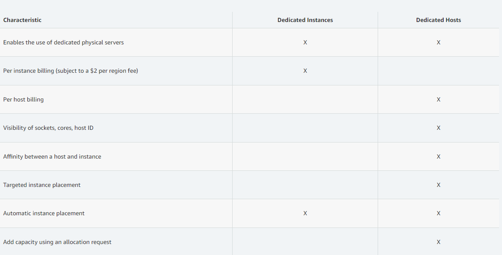

# EC2 #
## IaaS ##
EC2 - virtual machine\
EBS - storing data on virtual device\
ELB - load balance\
ASG - auto scaling group

## Bootstrap ##
- Lauching command when a machine starts
- User data

**Be careful of auto-scaling group**
<br/></br>
> ### **Advance setup** ###
> Metadata
> - enable the HTTP endpoint (default)
> - Metadata hot pot response: 
>   - The number of network hops that the metadata token can travel. Maximum is 64<br/>
> 
<br/><br/>
```bash
#!/bin/bash
# Use this for your user data (script from top to bottom)
# install httpd (Linux 2 version)
# add 'sudo'
yum update -y
yum install -y httpd
systemctl start httpd
systemctl enable httpd
echo "<h1>Hello World from $(hostname -f)</h1>" > /var/www/html/index.html
```

## [Instance Types](https://aws.amazon.com/ec2/instance-types/)
### **m5.2xlarge** ###
- m: instance class
- 5: generation
- 2xlarge: size of instance
### **Computer Optimized**
- compute intensive tasks
- e.g. HPC (high performance computing), machine learn...
### **Memory Optimized**
- Fast performance
- real-time tasks, processing unstructure data
- web scale cache
- RDB, non RDB, DB for BI (business intelligence)
### **Storage Optimized**
- high frequency transaction processing
- NoSQl  DB
- RWA (read write & access) large dataset
- data warehousing applicaiton
<br/><br/>
# Security
-firewall on EC2 instances (outside)
- contains only **allow** rule
- by IP / security groups
- **Timeout** = blocked
- connection refuse = application error
</br></br>
## SSH ##
Secure shell
- Cli / Putty / Instance connect (through browser)
- Port 22
```cli
ssh -i [keyfile] username@public-ip
```
### how to fix 'Permission 0644 for pem file' ###
- occur because file permission setting
- should not be accessed by others
```cli
chmod 0400 [file]
```
</br></br>
Windows Putty
- putty gen
- load private key file
- save private key
- (optional) passphrase more secure
- goto session
- load a session
- connection -> SSH -> Auth -> load ppk
- save session
</br></br>
## Instance with IAM ##
Actions -> security -> Modify IAM


# How to Choose EC2 #
## On-Demand
- predictable pricing
- bill per sec/hour
- high cost, no upfront payment
> short terms and un-interrupted workload
## Reserved (at least 1 year) ##
- long workload
- flexible
- Convertible reserved
  - can change instance type
  - up to 54% discount
- Scheduled reserved (deprecated)
- up to 75% discount
  - no/partial/all upfront
> steady state usage (database?)
## Spot 
- highest discount (90%)
- short workload
- less reliable
- cheap
- can lose instances(?) at any spot
  - resilient to failure
> batch jobs
> data analysis
> image processing
> any distributed workloads
> flexible start/end time
## Dedicated host
- entire physical server
- control placement
- 3-year allocation
> Bring your own license
> have strong regulatory or compliance needs
## Dedicated instance
- instance on hardware
- can share hardware in same account
- no control over instance placement

</br></br>
## Spot Instance ##
**Max Spot price**
- current < Max
- if greater, then terminate/stop within 2 mins

**Spot Block**
- within a time frame (1-6 hours) not reclaim
- one time request 
  - fail, cancel, close
- persistent (*have to stop this request before terminate*)
  - active, disabled

## Spot Fleets
define a pool
- lowest price
- diversitified
- capacity optimized
> automatically request a spot with lowest price

## Elasic IP ##
static ip

1. choose elastic ip
2. allocate ip
3. action -> associate ip with a instance
4. release ip (delete the ip)
</br></br>
## Placement group
- Cluster
  - all in same rack
  - <span style="color:green"> great network</span>
  - <span style="color:green"> lowest latency</span>
  - <span style="color:red"> single point failure</span>
> big data job, need complete fast
- Spread
  - locate on different hardwares
  - <span style="color:green"> low risk on simultaneous failure</span>
  - <span style="color:red"> limit to 7 instances per AZ per placement group</span>
  - <span style="color:red"> certain size of application</span>
> Maximise high availability of App
> requires isolation of one point failure
- Partition
  - up to 7 partiion per AZ
  - have many instances in each partition (up to 100 EC2)
  - <span style = "color:green">isolation within partition</span>
  - <span style = "color:green">EC2 access partition info as metadata</span>
> HDFS, Kafka, Cassandra
## ENI ##
- local components in VPC
- virtual network card

|ENI attributes |   |    |   |   |   |   |
|:---| :--- | :---| :---| :---| :---| :---|
|Primary private IPv4|one or more secondary IPv4
|One elastic IP per IPv4|
|One public IPv4|
|One or more security groups|
|A MAC address|

- attach IP to instance
- network failover
- ENI alongside with intances will be deleted when instances terminated


## EC2 Hibernate ##
