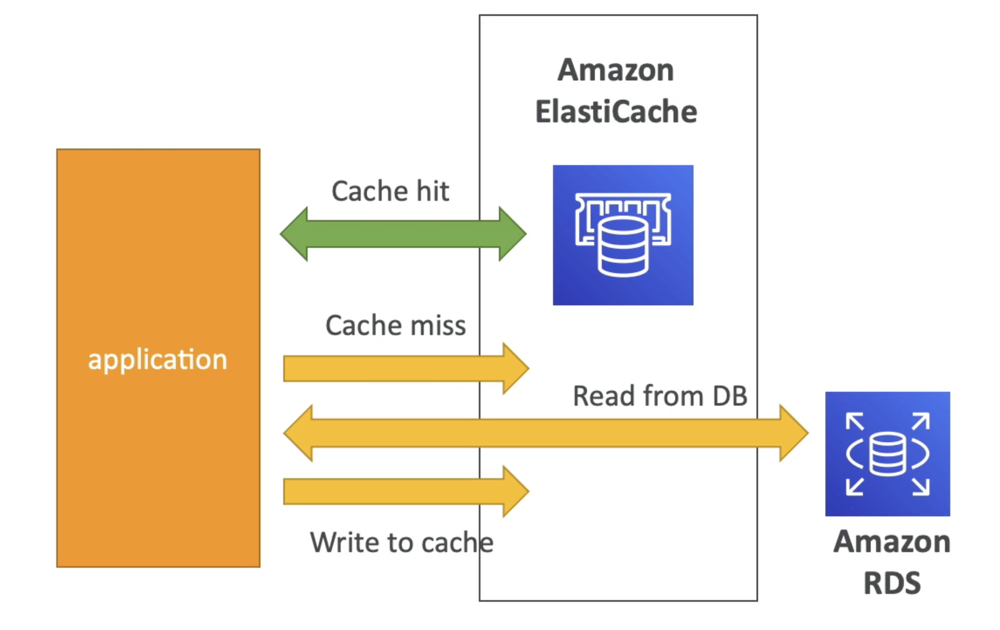
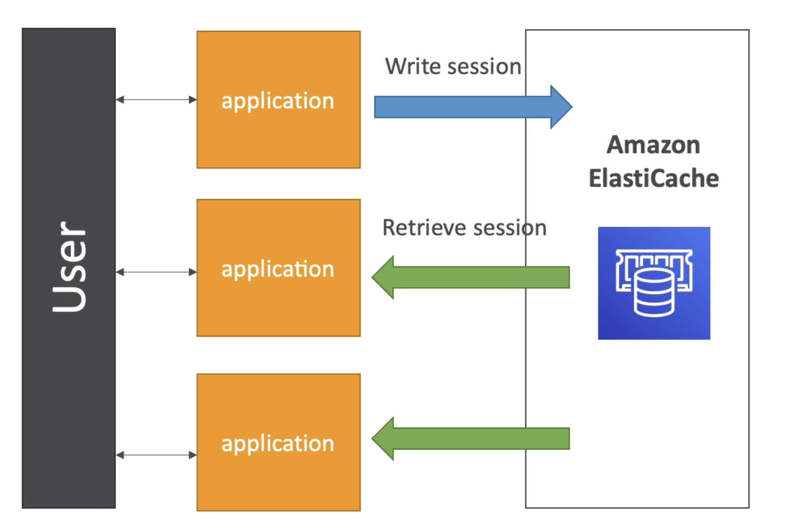

<link href = 'style.css' rel = 'stylesheet'>

# ElastiCache #

- In-memory DB
- managed Redis/Memcached
- <g>high performance
- <g>low latency
- <g>reduce load for DB (read intensive workloads)
- <g>stateless
- same benefits as DB
  - OS maintain/patching, optimization, setup, configuration, monitoring, failure recovery, backups

## Redis 
- <g>multi AZ, auto failover
- <g>read replicas to scale reads, HA
- <g>[AOF persistence](https://redis.io/docs/manual/persistence/) -> data durability
- <g>backup and restore
- <g>enhance robustness

## Memcached
- [sharding](https://zhuanlan.zhihu.com/p/57185574) (multi-nodes for partitioning of data)
- <r>NO</r> HA, persistent, backup and restore
- multi-threaded architecture
- high performance
- distributed

## <o>Redis</o> ##

- do not support IAM auth (which for API-level security)
- Redis AUTH
  - password/token
  - extra level, on top of security group
  - supprt SSL inflight
- Memcached
  - SASL-based auth (advanced)

## <cy>Patterns</cy> ##

- lazy loading    
  - stale in cache

- write through
  - no stale
- session store
  - TTL (time to live)

## <g>Gaming Leaderboards ##

- real time
- **Redis Sorted sets**
- uniquesness and element ordering
