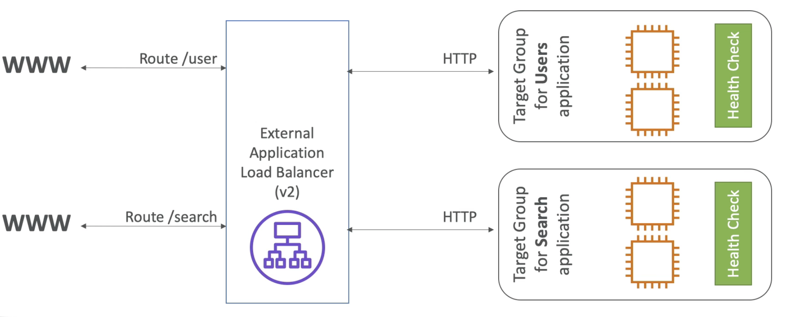
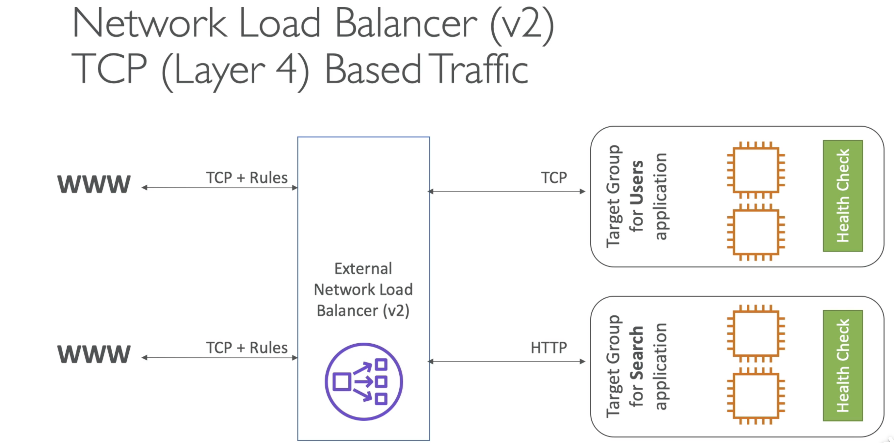
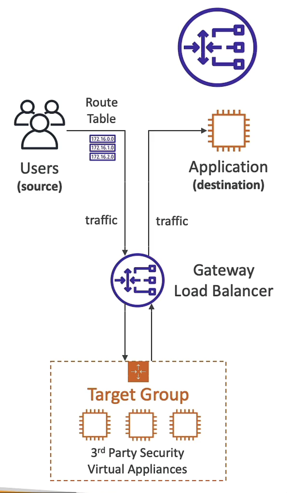
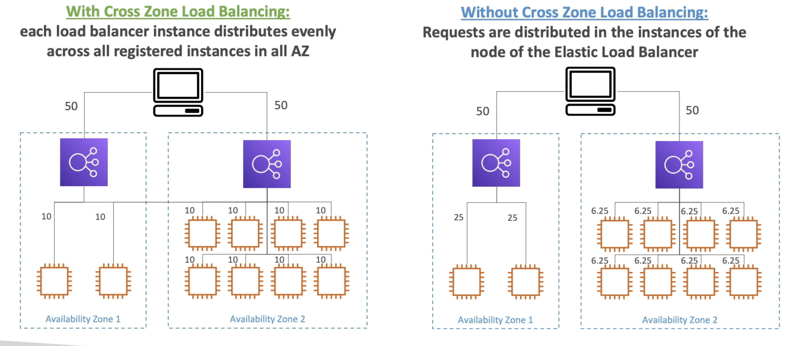
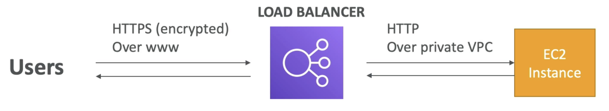

# Load Balance #

- Forward traffic, spread load across multiple downstream instance
- expose DNS of server to allow access
- handle failure
- regular health check
- provide SSL
- Enforce stickiness with cookies
- high abgailability AZ
- separate public/private traffic

### Health check

- crucial
- enable the LB if available for traffic or not

```http
Protocol: HTTP
Port: 4567
Endpoint: /health
```

### [Elastic Load Balancer](https://docs.aws.amazon.com/zh_tw/elasticloadbalancing/latest/userguide/what-is-load-balancing.html) ###

- managed load balancer
- less step
- intergrated with AWS
- newer generation is recommanded
- setup internal (private) or external (public)

## [**1. Classic Load Balance**](https://docs.aws.amazon.com/zh_tw/elasticloadbalancing/latest/classic/introduction.html) ##

- Http (layer 7), https (layer 7), tcp (layer 4), ssl (secure tcp)
- fixed hostname

## [**2. Application Load Balance**](https://docs.aws.amazon.com/zh_tw/elasticloadbalancing/latest/application/introduction.html) ##

- http, https, websocket
- based on route, direct to multi target group
  - Instance, HTTP
  - EC2 (manage my itself), HTTP
  - Lambda (private IP)
- health check on target group
- Fixed hostname
- X-Forward-Proto
  - hide true IP in header [X-Forward-For](https://developer.mozilla.org/zh-TW/docs/Web/HTTP/Headers/X-Forwarded-For), cannot be seen
  - use LB own private IP to communicate


## [**3. Network Load Balance**](https://docs.aws.amazon.com/zh_tw/elasticloadbalancing/latest/network/introduction.html) ##

- TCP, TLS (secure TCP), UDP (layer 4)
- less latency than ALB
- one static ip per AZ (helpful for whitlelisting ip)
- Extreme performance



## [**4. Gateway Load Balance**](https://docs.aws.amazon.com/zh_tw/elasticloadbalancing/latest/gateway/introduction.html) ##

- Operate at network layer 3 (IP protocol)
- deploy, scale and manage a fleet of 3rd party network virtual appliances
  - analyze traffic through this then,
  - send back to gateway then,
  - to app destination
- Firewall, IDS, IPS
- two functions
  - Transparent network gateway
    - only single entry
  - load balancer
    - Geneve, port 6081



## [5. Cross-zone Load Balancing](https://docs.aws.amazon.com/elasticloadbalancing/latest/classic/enable-disable-crosszone-lb.html) ##
- distribute traffics evenly
- cross all register instance in all AZ
- ALB
  - <g>always on</g>
  - free to pay (iner AZ)
- NLB
  - <r>default off </r>
  - pay for
- CLB
  - <r>default off</r>
  - free to pay (iner AZ)



### Security group (CLB, ALB) ###

> EC2 only allow LB traffic\
> EC setting \
> &emsp; -> Source \
> &emsp; -> a security group of LB

### [Sticky Session/Session Affinity](https://docs.aws.amazon.com/elasticloadbalancing/latest/application/sticky-sessions.html) (CLB, ALB) ###
> 'target group'
> -> 'edit attribute'

- always redirect to same instance behind LB\
- has an expire date\
- <g> ensure the session data\
- <r> imbalance load over EC2 instance behind </r>

> Application-based
> > custom cookie \
> > generate by target\
> > specify individually for each target group
> 
> > application cookie\
> > generate by LB\
> > name: AWSALBAPP
> 
> Duration-based
>> generate by LB
>> name: AWSALB (ALB), AWSELB (CLB)

<br></br>


## [\*\*ELB Product Comparison]((https://aws.amazon.com/elasticloadbalancing/features/#Product_comparisons)) ## 
<details>

<html>
    <table border="0">
        <tbody>
          <tr>
           <th width="20%" scope="col">Feature</th>
           <th width="20%" scope="col" style="text-align: center;" valign="middle">Application Load Balancer</th>
           <th width="20%" valign="middle" scope="col" style="text-align: center;">Network Load Balancer</th>
           <th width="20%" scope="col" valign="middle" style="text-align: center;">Gateway Load Balancer</th>
           <th width="20%" scope="col" valign="middle" style="text-align: center;">Classic Load Balancer</th>
          </tr>
          <tr>
           <td>Load Balancer type</td>
           <td style="text-align: center;">Layer 7</td>
           <td style="text-align: center;">Layer 4</td>
           <td style="text-align: center;">Layer 3 Gateway + Layer 4 Load Balancing</td>
           <td style="text-align: center;">Layer 4/7</td>
          </tr>
          <tr>
           <td style="text-align: left;">Target type</td>
           <td style="text-align: center;">IP, Instance, Lambda</td>
           <td style="text-align: center;">IP, Instance, Application Load Balancer</td>
           <td style="text-align: center;">IP, Instance</td>
           <td style="text-align: center;">&nbsp;</td>
          </tr>
          <tr>
           <td style="text-align: left;">Terminates flow/proxy behavior</td>
           <td style="text-align: center;">Yes</td>
           <td style="text-align: center;">Yes</td>
           <td style="text-align: center;">No</td>
           <td style="text-align: center;">Yes</td>
          </tr>
          <tr>
           <td height="19" width="178" style="text-align: left;">Protocol listeners</td>
           <td width="158" style="text-align: center;">HTTP, HTTPS, gRPC</td>
           <td width="152" style="text-align: center;">TCP, UDP, TLS</td>
           <td style="text-align: center;">IP</td>
           <td width="209" style="text-align: center;">TCP, SSL/TLS, HTTP, HTTPS</td>
          </tr>
          <tr>
           <td style="text-align: left;">Reachable via</td>
           <td style="text-align: center;">VIP</td>
           <td style="text-align: center;">VIP</td>
           <td style="text-align: center;">Route table entry</td>
           <td style="text-align: center;">&nbsp;</td>
          </tr>
          </table>
          <table>
          <tr>
          <td>&nbsp;</td><td>&nbsp;</td><td>&nbsp;</td><td>&nbsp;</td><td>&nbsp;</td>
          </tr>
            <th width="20%" scope="col">Feature</th>
           <th width="20%" scope="col" style="text-align: center;" valign="middle">Application Load Balancer</th>
           <th width="20%" valign="middle" scope="col" style="text-align: center;">Network Load Balancer</th>
           <th width="20%" scope="col" valign="middle" style="text-align: center;">Gateway Load Balancer</th>
           <th width="20%" scope="col" valign="middle" style="text-align: center;">Classic Load Balancer</th>
          </tr>
           <td height="19" width="178" colspan="5" style="text-align: center;"><b>Layer 7</b></td>
          </tr>
          <tr>
           <td style="text-align: left;">Redirects</td>
           <td style="text-align: center;">✔</td>
           <td style="text-align: center;">&nbsp;</td>
           <td style="text-align: center;">&nbsp;</td>
           <td style="text-align: center;">&nbsp;</td>
          </tr>
          <tr>
           <td style="text-align: left;">Fixed Response</td>
           <td style="text-align: center;">✔</td>
           <td style="text-align: center;">&nbsp;</td>
           <td style="text-align: center;">&nbsp;</td>
           <td style="text-align: center;">&nbsp;</td>
          </tr>
          <tr>
           <td style="text-align: left;">Desync Mitigation Mode</td>
           <td style="text-align: center;">✔</td>
           <td style="text-align: center;">&nbsp;</td>
           <td style="text-align: center;">&nbsp;</td>
           <td style="text-align: center;">&nbsp;</td>
          </tr>
          <tr>
           <td style="text-align: left;">HTTP header based routing</td>
           <td style="text-align: center;">✔</td>
           <td style="text-align: center;">&nbsp;</td>
           <td style="text-align: center;">&nbsp;</td>
           <td style="text-align: center;">&nbsp;</td>
          </tr>
          <tr>
           <td style="text-align: left;">HTTP2/gRPC</td>
           <td style="text-align: center;">✔</td>
           <td style="text-align: center;">&nbsp;</td>
           <td style="text-align: center;">&nbsp;</td>
           <td style="text-align: center;">&nbsp;</td>
          </tr>
          </table>
          <table>
        <tr>
          <td>&nbsp;</td><td>&nbsp;</td><td>&nbsp;</td><td>&nbsp;</td><td>&nbsp;</td>
          </tr>
            <th width="20%" scope="col">Feature</th>
           <th width="20%" scope="col" style="text-align: center;" valign="middle">Application Load Balancer</th>
           <th width="20%" valign="middle" scope="col" style="text-align: center;">Network Load Balancer</th>
           <th width="20%" scope="col" valign="middle" style="text-align: center;">Gateway Load Balancer</th>
           <th width="20%" scope="col" valign="middle" style="text-align: center;">Classic Load Balancer</th>
          </tr>
          <tr>
           <td colspan="5" style="text-align: center;"><b>Common configurations and characteristics</b></td>
          </tr>
          <tr>
           <td style="text-align: left;">Slow start</td>
           <td style="text-align: center;">✔</td>
           <td style="text-align: center;">&nbsp;</td>
           <td style="text-align: center;">&nbsp;</td>
           <td style="text-align: center;">&nbsp;</td>
          </tr>
          <tr>
           <td style="text-align: left;">Outpost support</td>
           <td style="text-align: center;">✔</td>
           <td style="text-align: center;">&nbsp;</td>
           <td style="text-align: center;">&nbsp;</td>
           <td style="text-align: center;">&nbsp;</td>
          </tr>
          <tr>
           <td style="text-align: left;">Local Zone</td>
           <td style="text-align: center;">✔</td>
           <td style="text-align: center;">&nbsp;</td>
           <td style="text-align: center;">&nbsp;</td>
           <td style="text-align: center;">&nbsp;</td>
          </tr>
          <tr>
           <td style="text-align: left;">IP address - Static, Elastic</td>
           <td style="text-align: center;">&nbsp;</td>
           <td style="text-align: center;">✔</td>
           <td style="text-align: center;">&nbsp;</td>
           <td style="text-align: center;">&nbsp;</td>
          </tr>
          <tr>
           <td style="text-align: left;">Connection draining (deregistration delay)</td>
           <td style="text-align: center;">✔</td>
           <td style="text-align: center;">✔</td>
           <td style="text-align: center;">✔</td>
           <td style="text-align: center;">✔</td>
          </tr>
          <tr>
           <td style="text-align: left;">Configurable idle connection timeout</td>
           <td style="text-align: center;">✔</td>
           <td style="text-align: center;">&nbsp;</td>
           <td style="text-align: center;">&nbsp;</td>
           <td style="text-align: center;">✔</td>
          </tr>
          <tr>
           <td style="text-align: left;">PrivateLink Support</td>
           <td style="text-align: center;">&nbsp;</td>
           <td style="text-align: center;">✔ (TCP, TLS)</td>
           <td style="text-align: center;">✔ (GWLBE)</td>
           <td style="text-align: center;">&nbsp;</td>
          </tr>
          <tr>
           <td style="text-align: left;">Zonal Isolation</td>
           <td style="text-align: center;">&nbsp;</td>
           <td style="text-align: center;">✔</td>
           <td style="text-align: center;">✔</td>
           <td style="text-align: center;">&nbsp;</td>
          </tr>
          <tr>
           <td style="text-align: left;">Session resumption</td>
           <td style="text-align: center;">✔</td>
           <td style="text-align: center;">✔</td>
           <td style="text-align: center;">&nbsp;</td>
           <td style="text-align: center;">&nbsp;</td>
          </tr>
          <tr>
           <td style="text-align: left;">Long-lived TCP connection</td>
           <td style="text-align: center;">&nbsp;</td>
           <td style="text-align: center;">✔</td>
           <td style="text-align: center;">✔</td>
           <td style="text-align: center;">&nbsp;</td>
          </tr>
          <tr>
           <td style="text-align: left;">Load Balancing to multiple ports on the same instance</td>
           <td style="text-align: center;">✔</td>
           <td style="text-align: center;">✔</td>
           <td style="text-align: center;">✔</td>
           <td style="text-align: center;">&nbsp;</td>
          </tr>
          <tr>
           <td style="text-align: left;">Load Balancer deletion protection</td>
           <td style="text-align: center;">✔</td>
           <td style="text-align: center;">✔</td>
           <td style="text-align: center;">✔</td>
           <td style="text-align: center;">&nbsp;</td>
          </tr>
          <tr>
           <td style="text-align: left;">Preserve Source IP address</td>
           <td style="text-align: center;">✔</td>
           <td style="text-align: center;">✔</td>
           <td style="text-align: center;">✔</td>
           <td style="text-align: center;">&nbsp;</td>
          </tr>
          <tr>
           <td style="text-align: left;">WebSockets</td>
           <td style="text-align: center;">✔</td>
           <td style="text-align: center;">✔</td>
           <td style="text-align: center;">✔</td>
           <td style="text-align: center;">&nbsp;</td>
          </tr>
          <tr>
           <td style="text-align: left;">Supported network/Platforms</td>
           <td style="text-align: center;">VPC</td>
           <td style="text-align: center;">VPC</td>
           <td style="text-align: center;">VPC</td>
           <td style="text-align: center;">EC2-Classic, VPC</td>
          </tr>
          <tr>
           <td style="text-align: left;">Cross-zone Load Balancing</td>
           <td style="text-align: center;">✔</td>
           <td style="text-align: center;">✔</td>
           <td style="text-align: center;">✔</td>
           <td style="text-align: center;">✔</td>
          </tr>
          <tr>
           <td style="text-align: left;">IAM Permissions(Resource, Tag based)</td>
           <td style="text-align: center;">✔</td>
           <td style="text-align: center;">✔</td>
           <td style="text-align: center;">✔</td>
           <td style="text-align: center;">✔ (Only resource based)</td>
          </tr>
          <tr>
           <td style="text-align: left;"><br> Flow Stickiness (All packets of a flow are sent to one target, and return traffic comes from same target)</td>
           <td style="text-align: center;"><br> Symmetric</td>
           <td style="text-align: center;"><br> Symmetric</td>
           <td style="text-align: center;"><br> Symmetric</td>
           <td style="text-align: center;"><br> Symmetric</td>
          </tr>
          <tr>
           <td style="text-align: center;"><br> Target Failure behavior<br> </td>
           <td style="text-align: center;">Fail close on targets, unless all targets are unhealthy(fail open)</td>
           <td style="text-align: center;">Fail close on targets, unless all targets are unhealthy(fail open)</td>
           <td style="text-align: center;">Existing flows continue to go to existing target appliances, new flows are rerouted to healthy target appliances.</td>
           <td style="text-align: center;">&nbsp;</td>
          </tr>
          <tr>
           <td style="text-align: left;">Health Checks</td>
           <td style="text-align: center;">HTTP, HTTPS, gRPC</td>
           <td style="text-align: center;">TCP, HTTP, HTTPS</td>
           <td style="text-align: center;">TCP, HTTP, HTTPS</td>
           <td style="text-align: center;">TCP, SSL/TLS, HTTP, HTTPS</td>
          </tr>
          </table>
        <table>
                    <tr>
          <td>&nbsp;</td><td>&nbsp;</td><td>&nbsp;</td><td>&nbsp;</td><td>&nbsp;</td>
          </tr>
            <th width="20%" scope="col">Feature</th>
           <th width="20%" scope="col" style="text-align: center;" valign="middle">Application Load Balancer</th>
           <th width="20%" valign="middle" scope="col" style="text-align: center;">Network Load Balancer</th>
           <th width="20%" scope="col" valign="middle" style="text-align: center;">Gateway Load Balancer</th>
           <th width="20%" scope="col" valign="middle" style="text-align: center;">Classic Load Balancer</th>
          </tr>
          <tr>
           <td colspan="5" style="text-align: center;"><b>Security</b></td>
          </tr>
          <tr>
           <td style="text-align: left;">SSL Offloading</td>
           <td style="text-align: center;">✔</td>
           <td style="text-align: center;">✔</td>
           <td style="text-align: center;">&nbsp;</td>
           <td style="text-align: center;">✔</td>
          </tr>
          <tr>
           <td style="text-align: left;">Server Name Indication (SNI)</td>
           <td style="text-align: center;">✔</td>
           <td style="text-align: center;">✔</td>
           <td style="text-align: center;">&nbsp;</td>
           <td style="text-align: center;">&nbsp;</td>
          </tr>
          <tr>
           <td style="text-align: left;">Back-end Server Encryption</td>
           <td style="text-align: center;">✔</td>
           <td style="text-align: center;">✔</td>
           <td style="text-align: center;">&nbsp;</td>
           <td style="text-align: center;">✔</td>
          </tr>
          <tr>
           <td style="text-align: left;">User Authentication</td>
           <td style="text-align: center;">✔</td>
           <td style="text-align: center;">&nbsp;</td>
           <td style="text-align: center;">&nbsp;</td>
           <td style="text-align: center;">&nbsp;</td>
          </tr>
          <tr>
           <td style="text-align: left;">Custom Security Policy</td>
           <td style="text-align: left;">&nbsp;</td>
           <td style="text-align: left;">&nbsp;</td>
           <td style="text-align: left;">&nbsp;</td>
           <td style="text-align: center;">✔</td>
          </tr>
          <tr>
           <td style="text-align: left;">ALPN</td>
           <td style="text-align: center;">✔</td>
           <td style="text-align: center;">✔</td>
           <td style="text-align: center;">&nbsp;</td>
           <td style="text-align: center;">&nbsp;</td>
          </tr>
          </table>
          <table>
                    <tr>
          <td>&nbsp;</td><td>&nbsp;</td><td>&nbsp;</td><td>&nbsp;</td><td>&nbsp;</td>
          </tr>
            <th width="20%" scope="col">Feature</th>
           <th width="20%" scope="col" style="text-align: center;" valign="middle">Application Load Balancer</th>
           <th width="20%" valign="middle" scope="col" style="text-align: center;">Network Load Balancer</th>
           <th width="20%" scope="col" valign="middle" style="text-align: center;">Gateway Load Balancer</th>
           <th width="20%" scope="col" valign="middle" style="text-align: center;">Classic Load Balancer</th>
          </tr>
          <tr>
           <td colspan="5" style="text-align: center;"><b>Kubernetes Controller</b></td>
          </tr>
          <tr>
           <td style="text-align: left;">Direct-to-pod</td>
           <td style="text-align: center;">✔</td>
           <td style="text-align: center;">✔ (Fargate pods)</td>
           <td style="text-align: center;">&nbsp;</td>
           <td style="text-align: center;">&nbsp;</td>
          </tr>
          <tr>
           <td style="text-align: left;">Load Balance to multiple namespaces</td>
           <td style="text-align: center;">✔</td>
           <td style="text-align: center;">&nbsp;</td>
           <td style="text-align: center;">&nbsp;</td>
           <td style="text-align: center;">&nbsp;</td>
          </tr>
          <tr>
           <td style="text-align: left;">Support for fully private EKS clusters</td>
           <td style="text-align: center;">✔</td>
           <td style="text-align: center;">✔</td>
           <td style="text-align: center;">&nbsp;</td>
           <td style="text-align: center;">&nbsp;</td>
          </tr>
          </table>
          <table>
                    <tr>
          <td>&nbsp;</td><td>&nbsp;</td><td>&nbsp;</td><td>&nbsp;</td><td>&nbsp;</td>
          </tr>
            <th width="20%" scope="col">Feature</th>
           <th width="20%" scope="col" style="text-align: center;" valign="middle">Application Load Balancer</th>
           <th width="20%" valign="middle" scope="col" style="text-align: center;">Network Load Balancer</th>
           <th width="20%" scope="col" valign="middle" style="text-align: center;">Gateway Load Balancer</th>
           <th width="20%" scope="col" valign="middle" style="text-align: center;">Classic Load Balancer</th>
          </tr>
          <tr>
           <td colspan="5" style="text-align: center;"><b>Logging and monitoring</b></td>
          </tr>
          <tr>
           <td style="text-align: left;">CloudWatch Metrics</td>
           <td style="text-align: center;">✔</td>
           <td style="text-align: center;">✔</td>
           <td style="text-align: center;">✔</td>
           <td style="text-align: center;">✔</td>
          </tr>
          <tr>
           <td style="text-align: left;">Logging</td>
           <td style="text-align: center;">✔</td>
           <td style="text-align: center;">✔</td>
           <td style="text-align: center;">✔</td>
           <td style="text-align: center;">✔<br> </td>
          </tr>
         </tbody>
        </table>
</html>
</details>

<br></br>
## SSL/TLS ##
- encrypted transit
- issued by CA, e.g. Digicert
- will be expired
- LB: [X.509 cert](https://zh.wikipedia.org/zh-tw/X.509)
- ACM (AWS Certificate Manager)
- HTTPS
  - specify a cert
  - add lists tp support domains
  - ***SNI (Server Name Indication)*** by clients
    - specify hostname
    - load multiple certs on 1 web server (serve multiple websites)
    - NEWER protocol: indicate hostname at first handshake
    - <g>ALB, NLB</g>: support N listenser and certs
    - <r>CLB</r>: support one cert only



## Connection Draining (CLB) ## 
- ### Deregistration Delay (ALB/NLB) ###

When the instances are unhealthy or de-registrating:
- [in-flight request time](https://stackoverflow.com/questions/48524418/what-does-in-flight-request-mean-for-a-web-browser)
- stop sending requests
- default: 300s (0-3600s)

</br>

## Auto-Scaling Group ##

- automatically add/minus the instances
- horizontal
- vertical
- EC2 based Health check: <y>default</y>

> ## Dynamic scaling policies ##
- Tracking
  - simple and easy set-up
- simple/step scaling
  - CloudWatch alarm
- scheduled actions
  - based on pattern
- predictive scaling
  - analyze historical load, then
  - generate forecase (continous), then
  - schedule calling actions
  
## Metrics ##
- CPU
- Request CountPer Target
  - stable number of requests
- average in/out
  - Any threshold

## Scaling Cooldowns ##
- 300s
> **ready-to-use AMI**\
> faster requests serving\
> ↓ cooldown period -> more dynamic scale up/down

## <cy>so How to terminate?</cy> ##

1. find AZ which has highest # of instance
2. delete the oldest
3. Aim: balance the # among diff. AZ

<link href="style.css" rel="stylesheet"></link>

## Lifecycle Hook ##

- can perform extra steps before inService, or
- before terminated

## Launch Configuration ##

- legacy
- recreate is needed everytime update

## Launch Template ##

- multiple version
- parameter subnet (reuse/inheritance)
- on-demand/spot provision
- T2 unlimited burst feature
- recommand by AWS