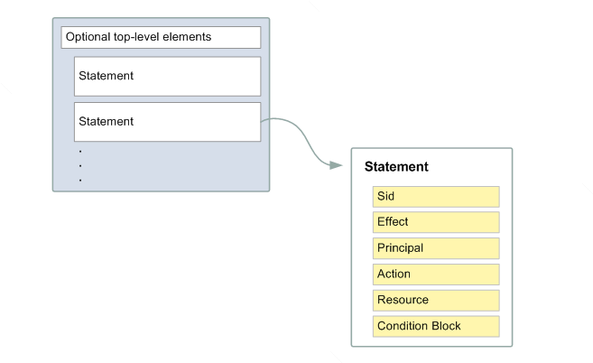

<link href="style.css" rel="stylesheet"></link>

# IAM #

## Policy type / Policy Statement ##



- password policy
## MFA ##
Multi factor authentication
- activate in account
- virtual device
  - one time password
  - tokens for authentication
- U2F (universal 2nd Factor)
  - physical
  - 3rd party

IAM Access Key
User -> Security 
```aws cli 
aws iam list-users
```

IAM role for Servies
- allow service access other services
- common:
  - EC2 instance + IAM role -> call other service
  - Lambda
  - CloudFormation
<br/><br/>
## IAM Security tool ##
### Credential report
- CSV file
### IAM Access Advisor ###
- log
<br/><br/>
## AWS Shared Responsibilities

