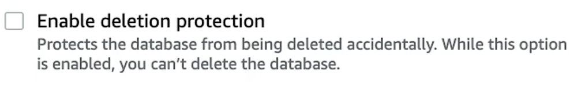
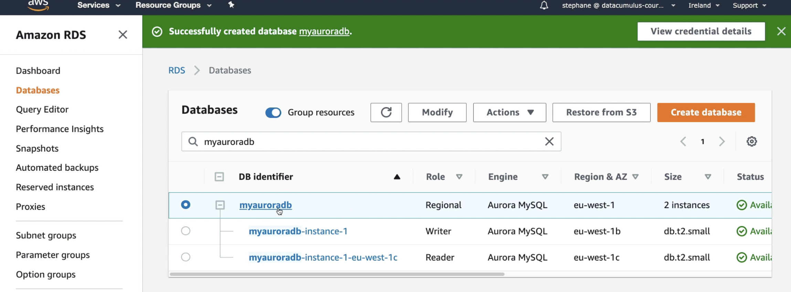
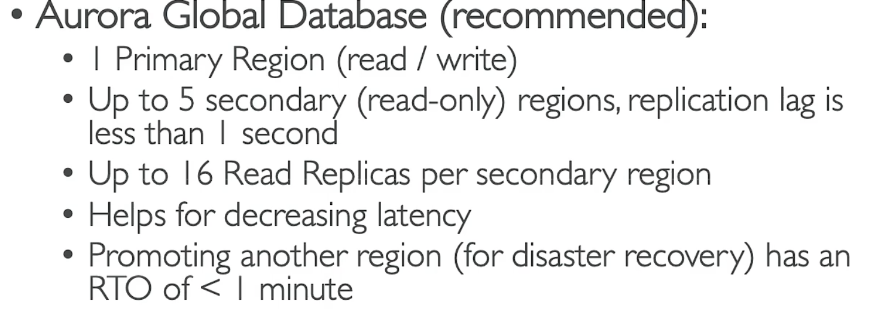

<link href = "style.css" rel = "stylesheet">

# RDS #

- deploy DB on EC2
-  manage DB service through SQL query
   -  auto-provisioning, OS patching
   -  monitoing dashboard
   -  multi AZ for disactre recovery
   -  Continous Backup, timestamp revocery
   -  scaling capability
   -  storage backed by EBS (gp2/io1)
-  SQL, AURORA (AWS), ...
-  cannot SSH connect

## Back-up ##
- auto-enabled in RDS
- Auto-backup
  - daily full back up
  - tracsation log back-up for every 5 mins
  - 7-35 days retension
### Back-up snapshot ###
- manually
- no retension limit

## Storage scaling ##
- increase storage dymaniclly when detect runnning out of free storage
- set **Maximun Storage Threadshold** 
- <g>unpredictable workload
- <g>support all DB engines</g>

> Auto-modify if:\
> free storage 10% left\
> Low-storage last at least 5 mins\
> 6 hours no modify action

## [Read Replicas](https://aws.amazon.com/tw/rds/features/read-replicas/) ##
- up to 5 replicas
- within or X-region
- **Async**, reads are eventually consistent
- App must update connection string 

## Disaster recovery (multi AZ)
- SYNC
- one DNS name
- auto-app failover
- <l style = ' font-size : 15pt'>↑</l>availbility
- No manually intervention
- no use for scaling (just standby)

### <cy> How to go multi AZ from single </cy> ###

- no downtime
- just click 'modify'
1. snapshot taken
2. new DB restored by this snapshot
3. sync between two DB
4. unable to delete until uncheck protection
   


<br>

## RDS security ##

**At rest**
- AWS KMS / AES256 
- Defind before launch
- only encrypted master can has encrypted read replicas/snapshot
  - copy unencrypted snapshot to create encrypted snapshot
- TDE (Transperant Data Encrpytion) for Oracle/SQL server

**In-flight**
- SSL, * to RDS
- different SSL options
- enforce SSL (Make sure all clients using ssl)

i.e. In AWS RDS console (Parameter group) under **PstgredSQL**:
```SQL
rds.force_ssl = 1
```
**MySQL**:
```sql
GRANT USAGE ON *.* TO 'mysqluder'@'%' REQUIRE SSL;
```

## Network IAM Security ##

- within private network
- security group control

<br>

- IAM policies (through RDS API)
- traditional admin and pwd
- IAM-based authentication 
  - no pwd needed, but authentication token through **IAM&RDS API call**
  - token last long 15 mins

- <g> IO encrypted
- <g>centrally manage user
- <g>IAM role and EC2 profile intergration easy

## <b>Aurora</b> ##

- compatible with <hl>postgreSQL and MySQL</hl>
- cloud optimized
- storage auto-grows (10GB to 128TB)
- up t0 15 replicas, process faster
- failover, high availability
- 20% cost than RDS
- restore by timestamp

### <bl>details abt HA and read scaling</bl> ###

- 6 copies every time across 3 AZ
  - 4 for write
  - 3 for read
  - shared storage volume
-  One Aurora instance takes writes (**master**)
   -  up to 15 replicas
   -  auto-scaling
   -  failover less than 30s
   -  X-region replication
   -  Endpoint, connect to writer/reader (not recommended)
      -  **reader enpoint**: point all read replicas (load balancing)
      -  **writer enpoint(DNS name)**: point to master



### <bl>details abt HA and read scaling</bl> ###

- 1 writer, n readers
  - many readers can connect
  - allow most workload
- 1 writer, n readers (parallel query)
  - performance of analytic queries
  - hybird transactional/analytic workload
- n writers
  - requires continous writers
- serverless
  - specify max./min. resources
  - intermittent/unpredictable workloads
  - scalable

## <o>Aurora security</o> ##

- same engine with RDS
- user responsible at security group

## <cy>Auto-scaling</cy> ##
> replica auto-scaling
- Writer endpoint
- reader endpoint (extend with scaling)
> custom endpoint
- subnet as custom endpoint
- set up diff endpoint for diff workload
> serverless
- <g>no capacity planning
- pay per sec, <g>cost-effective
> multi-master
- immedate failover for write node (HA)
- every nodes can R/W (vs RR, one write node fail, need to promot new RR as master)
> gload aurora
- X-region
  - disater revocery
  - RTO -> recover time objective



**Aurora ML**

- prediction via SQL
- support SageMaker (any ML model), Comprehend (sentiment analysis)
- <g>no ML exp
- e.g. fraud detection, ads targeting, sentiment analysis, product recommend